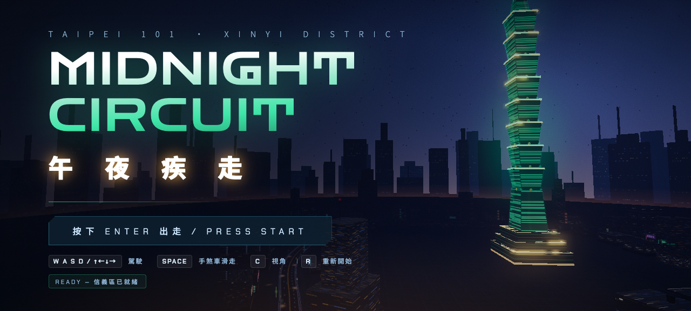
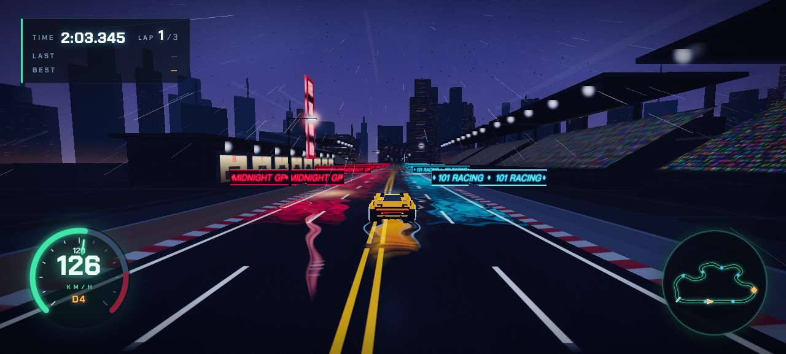
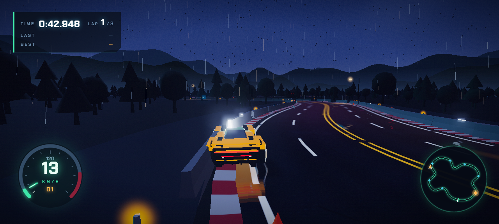
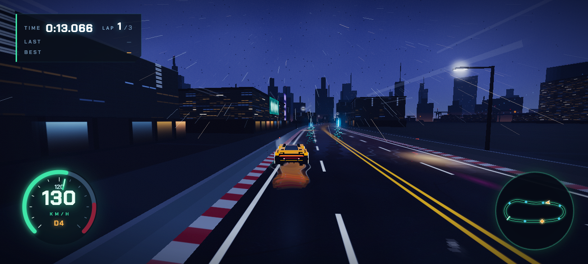
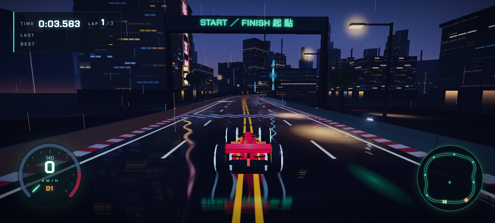
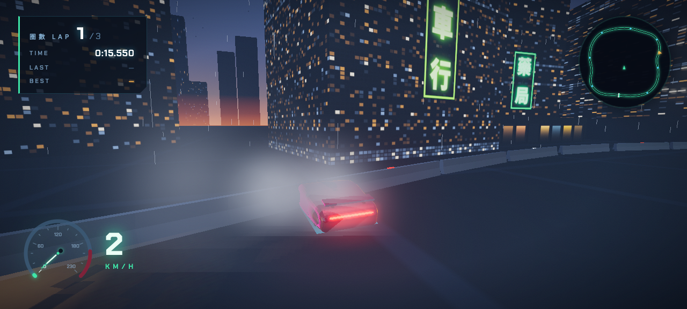
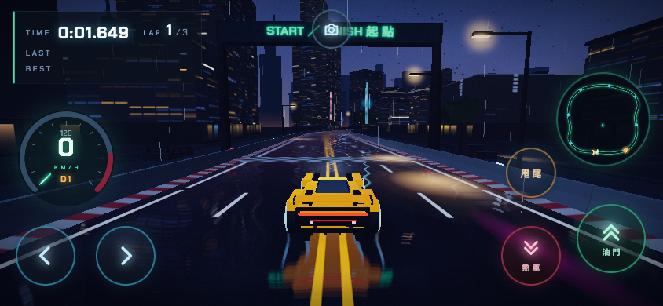

# TAIPEI 101 — Midnight Circuit 午夜疾走

> 🇹🇼 [中文版說明請見 README.zh-TW.md](./README.zh-TW.md)
>
> 🎮 **Play now: <https://swchen44.github.io/racing-101-game/>** (desktop / tablet / phone-landscape)

A third-person 3D arcade racing game set in a rain-slicked neon Taipei at midnight. Built with **vanilla Three.js** — every asset (the 101 tower, four tracks, eight cars, every texture and sound) is **100% procedurally generated** in code. No model files, no image assets, no audio files.



| Taipei GP Circuit | Mountain Pass | Wangan Speedway |
|---|---|---|
|  |  |  |

| Formula on wet streets | Taipei Taxi & neon reflections | Touch controls (mobile) |
|---|---|---|
|  |  |  |


## 📚 Documentation

- **[Player Guide 玩家手冊](docs/PLAYER-GUIDE.md)** — install (PWA/offline), controls, modes, tracks & cars
- **[Admin Guide 管理者手冊](docs/ADMIN-GUIDE.md)** — deployment, Supabase, leaderboard & sponsor management
- **[Game Design 遊戲設計手冊](docs/GAME-DESIGN.md)** — scenes, rules, physics/AI models, data flow
- **[Ad Sales Kit 廣告刊登方案](docs/AD-SALES-KIT.md)** — billboard slots, asset specs, publishing SOP

---

## 🎮 User Guide

### Play

Online: **<https://swchen44.github.io/racing-101-game/>** — or run locally with any static server (ES modules need HTTP):

```bash
git clone https://github.com/swchen44/racing-101-game.git
cd racing-101-game
python3 -m http.server 8080     # or: npx serve
# open http://localhost:8080
```

Requires a WebGL2 browser. On phones/tablets play in **landscape** — neon touch controls appear automatically.

### Game flow

1. **Enter your email account** (case-insensitive, remembered in your browser)
2. Pick **mode → AI level → time of day → track → car → transmission**, then race
3. Results are saved to the local leaderboard (and to the global one if configured — see below)

### Modes

| Mode | Rule |
|---|---|
| ⏱ **Time Attack** | 2 laps against the clock; best laps saved per track × mode |
| 🚨 **Police Chase** | Two units — one blocks ahead, one rams behind (PIT); escape triggers roadblocks. Boxed in at low speed → BUSTED |
| 🏆 **Grand Prix** | Race 5 AI drivers with racing lines, avoidance and rubber-banding. Take P1 |

### Tracks

| Track | Character |
|---|---|
| 信義午夜街道 Xinyi Midnight | Streets around Taipei 101, neon signs, 1.6 km |
| 灣岸高速環道 Wangan Speedway | Harbor highway ring: cranes, container yards, sea bridge, 2.9 km — top-speed run |
| 陽明山夜峠 Mountain Pass | Hairpin touge in layered mountains and forest, 1.3 km — drift heaven |
| 台北大獎賽環道 Taipei GP | F1-grade: grandstands, pit building, DRS straight, tyre walls, 2.4 km |

### Cars (8)

Formula TF-01 (250 km/h, 8-speed) ・ GT Blaze ・ Thunder EV-S (single-speed EV) ・ Rally R4 (loose tail) ・ Trail Titan pickup ・ Taipei Taxi 55688 ・ City e-GO ・ Summit SUV — each with distinct procedural bodywork and physics tuning (top speed, grip, drift character, gear count).

### Controls

| Key | Action |
|---|---|
| `W A S D` / arrows | Drive |
| `Space` | Handbrake / drift |
| `Q` / `E` | Shift down / up (manual transmission) |
| `⇧Shift` | BOOST (3 per race) |
| `C` | Camera (chase / far / cockpit / bumper); `M` rear-view mirror |
| `R` | Restart, `Enter` menus, `Esc` back |

Touch: on-screen steering, throttle, brake, drift and shift buttons (landscape only).

### Global leaderboard (optional, free)

Local scores always work. To enable the **worldwide leaderboard** (name + masked IP shown), create a free Supabase project and paste its URL/anon key into `js/config.js` — full 5-minute walkthrough in [SETUP-LEADERBOARD.md](./SETUP-LEADERBOARD.md). Privacy: only a masked IP (e.g. `140.112.x.x`) is ever uploaded.

---

## 🎨 Design Document

### Aesthetic — "Rainy Night in Taipei"

Jade-green glass of the 101, sodium streetlights, Chinese neon signage, teal-and-amber grade under ACES tone mapping with bloom; a three-slot time-of-day system (night / dusk / day); **dry asphalt** with procedural normal + roughness maps for aggregate grain (the wet-reflection pipeline is kept in code for a future rain mode).

### World building

- **Tracks** are closed CatmullRom splines; road, curbs, sidewalks and barriers are ribbon geometries extruded along the spline, with canvas-painted albedo + emissive lane markings. Each track carries a *theme* (sky colors, building density, neon palette, landmark) driving the procedural city: Taipei 101 with its 8 flared "dou" segments; a harbor with cranes, container stacks and a lit sea bridge; layered mountain ridges with ~2,600 instanced trees; an F1 venue with crowd-textured grandstands, pit lane and searchlights.
- **Fake light budget**: light pools, sign glows and halos are additive sprites; real dynamic lights ≤ 3 (moon with shadows, headlights, fill), keeping 60 fps.

### Vehicle & physics

Custom arcade physics at 120 Hz fixed step: forward/lateral velocity decomposition, exponential lateral grip (weakened under handbrake → controllable drift), speed-scaled yaw. **Transmission model**: per-gear speed bands with a torque curve and rev-limiter cutoff — automatic shifts near redline, manual (Q/E) rewards shifting at the line; EVs are single-speed with flat torque. Wall collision is solved analytically against the spline (lateral clamp + restitution + heading alignment), O(1) per frame.

### AI

- **Grand Prix**: kinematic line-followers with apex-seeking lanes, curvature-based corner speeds, mutual avoidance, squeeze-upset wobble, reaction-time starts, post-finish coasting and ±6 % rubber-banding.
- **Police**: progress-based pursuit with PIT maneuvers, lap-2 reinforcements, escape-triggered roadblocks (crashable barriers), two-tone Web Audio siren with distance attenuation, and a low-speed proximity "busted" meter.

### Audio

Entirely Web Audio: engine (sawtooth + sub-square through filters, driven by real gearbox rpm), drift screech, wind, sirens, collisions, UI beeps, fanfares.

---

## 🛠 Developer Guide

### File structure

```
index.html          Menus (name/mode/track/car/transmission), HUD DOM/CSS, touch UI, import map
js/config.js        Central definitions: TRACKS (spline+theme), CARS (tune+stats), MODES, leaderboard config
js/main.js          Renderer, lighting, world lifecycle (build/dispose), menu flow, race state machine, main loop
js/track.js         Track(def): spline sampling, query(), road/curb/barrier meshes, wet-reflection road shader
js/vehicle.js       Car(track, def, {transmission}): physics + gearbox; visuals dispatched to cars/
js/cars/            One file per car model (f1, gt, evsport, rally, pickup, taxi, evcity, suv) + common.js helpers
js/city.js          createCity(track, theme): buildings, neon, streetlights + harbor/mountain/grandstand envs
js/taipei101.js     The landmark tower
js/reflections.js   Planar reflection render target + shared uniforms (REFLECT_LAYER)
js/effects.js       Bloom + color grade + radial blur, skid marks, smoke, sparks, rain, speed streaks
js/opponents.js     Grand Prix AI       js/police.js  Police AI
js/leaderboard.js   Local scores + optional Supabase REST adapter (masked IP)
js/hud.js           Gauge/minimap/timers/position/wanted   js/camera.js  Chase camera
js/audio.js         Web Audio synthesis (engine, siren…)   js/touch.js   Touch controls
```

### Key contracts

- `Track.query(pos, hint)` → `{ index, s, lateral, tangent }` — lap progress + wall collision basis; checkpoints at `s = k/8`.
- Car builders: `build(def) → { mesh, parts }` (see `cars/gt.js`); physics tuning in each car's `tune` in config.js.
- `window.__game` QA hook: `{ car, race, track, setup, startRace, teleport(s, kmh) }` — drive any track/car/mode from the console.
- **Dispose discipline**: worlds and cars are rebuilt per race; always route removals through `disposeObject()` (cars/common.js) — shared cached textures are marked `userData.shared`.

### Performance rules

InstancedMesh for everything repeated; canvas textures ≤ 1024 px; ≤ 3 real lights; reflection target 512 px; auto quality scaler drops pixelRatio below 42 fps.

### Development approach

Built by a multi-agent pipeline: core architecture first, then parallel specialist agents with **exclusive file ownership** (car modeling ×3, track theming, reflections, touch UI, AI behaviors), each self-verifying in its own headless-browser session, followed by integration passes and harsh art-director review rounds.

## License

[MIT](./LICENSE)
