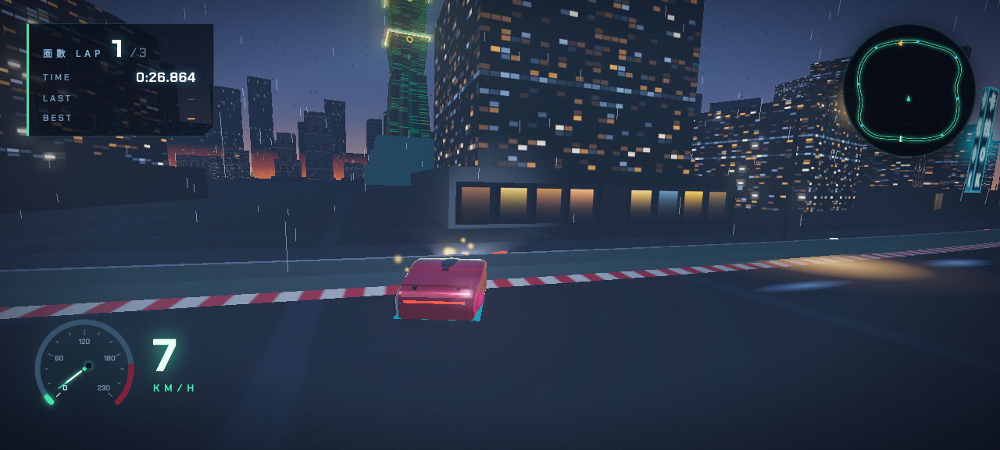

# TAIPEI 101 — Midnight Circuit 午夜疾走

> 🇹🇼 [中文版說明請見 README.zh-TW.md](./README.zh-TW.md)

A third-person 3D arcade racing game set on the rain-slicked neon streets of Taipei's Xinyi District, circling the Taipei 101 tower at midnight. Built with **vanilla Three.js** — every asset (the tower, the city, the car, every texture and sound) is **100% procedurally generated** in code. No model files, no image assets, no audio files.


| | | |
|---|---|---|
|  |  |  |

---

## 🎮 User Guide

### Play

You need any static file server (ES modules require HTTP, not `file://`):

```bash
git clone https://github.com/swchen44/racing-101-game.git
cd racing-101-game
python3 -m http.server 8080     # or: npx serve
# open http://localhost:8080
```

Requires a WebGL2-capable browser (Chrome / Edge / Firefox / Safari). Three.js is loaded from CDN — an internet connection is needed on first load.

### Controls

| Key | Action |
|---|---|
| `W` / `↑` | Accelerate |
| `S` / `↓` | Brake / Reverse |
| `A` `D` / `←` `→` | Steer |
| `Space` | Handbrake — hold while turning to **drift** |
| `C` | Cycle camera (chase / far / bumper) |
| `R` | Restart race |
| `Enter` | Start from title screen |

### Rules

- **3 laps** around the closed circuit surrounding Taipei 101.
- **8 ordered checkpoints** validate your lap — no shortcuts count.
- Your **best lap** is saved locally (`localStorage`) and shown on the HUD; beating it triggers a NEW RECORD flash.
- Concrete barriers line the whole track: scraping them showers sparks and costs speed. A **WRONG WAY** warning appears if you turn around.

---

## 🎨 Design Document

### Aesthetic direction — "Rainy Night in Xinyi"

One committed look: Taipei's Xinyi district at midnight after rain. Jade-green glass of the 101 tower, sodium-amber streetlights, Chinese neon signage (誠品書店, 深夜食堂, 珍珠奶茶…), wet asphalt reflecting everything, and a teal-and-amber cinematic grade under ACES tone mapping with bloom. HUD typography pairs a display face (Zen Dots) with Chakra Petch and Noto Sans TC for a bilingual motorsport identity.

### World building

- **Track**: a closed CatmullRom spline (~1.6 km) encircling the tower. The road, curbs, sidewalks and barriers are *ribbon geometries* extruded along the spline. Lane markings and asphalt grain are canvas-painted textures with an emissive pass so markings stay readable at night.
- **Taipei 101**: procedurally assembled from its signature architecture — a podium, a tapered base, **8 flared "dou" segments** (wider at top, the rice-bowl motif), ruyi ornaments, a crown and a spire with a blinking aviation beacon, up-lit by spotlights in the nightly jade color.
- **City**: buildings are instanced boxes with double canvas textures (dark albedo + emissive lit-windows with realistic lighting logic — contiguous lit runs, darker high floors, some fully dark buildings). Neon signs are canvas-rendered Chinese text with glow. A distant skyline silhouette ring and a gradient-shader sky with stars and light-pollution horizon close the scene.
- **Fake light budget**: streetlight pools, sign glow and lamp halos are additive sprites/decals — almost zero real lights. Real dynamic lights are limited to the moon (with shadows), the car's headlights and a small fill light, keeping the frame at 60 fps.

### Vehicle & physics

Custom arcade physics (no physics engine): velocity is decomposed into forward/lateral components each fixed step (120 Hz). Lateral grip is exponentially damped — weak damping under handbrake produces controllable **drift**; yaw gain scales with speed and gets a drift boost. Wall collision is solved *analytically against the spline*: the car's lateral offset from the track centerline is clamped to the barrier width, with restitution, spark bursts and heading alignment. This is O(1) per frame via a hint-tracked nearest-sample search.

### Camera & game feel

Spring-damped chase camera with speed-scaled FOV (62°→84°), high-speed camera dip, drift side-offset, collision shake, corner-apex look-ahead (reads track curvature 35 m ahead) and a **landmark framing system**: when the car faces Taipei 101, the camera lifts and side-shifts to compose the tower into the upper third of the frame.

### Audio

Entirely Web Audio API: engine = sawtooth + sub-square through a low-pass filter with simulated gear steps; drift screech = band-passed noise; wind, exhaust, collision thumps, countdown beeps and a finish fanfare are all synthesized at runtime.

---

## 🛠 Developer Guide

### File structure

```
index.html          HUD DOM/CSS, title & results screens, import map (three@0.160 CDN)
js/main.js          Renderer, scene, lighting, state machine, fixed-step main loop
js/track.js         Track class: spline, sampling, query(), all track meshes
js/vehicle.js       Car class: procedural car model + arcade physics
js/taipei101.js     createTaipei101(): the landmark
js/city.js          createCity(track): ground, sky, buildings, neon, streetlights
js/effects.js       Effects: bloom composer, skid marks, smoke, sparks, rain
js/audio.js         GameAudio: all Web Audio synthesis
js/hud.js           HUD: gauge canvas, minimap canvas, timers, messages
js/camera.js        ChaseCamera: spring follow, FOV, framing, shake
```

### Key contracts

- `Track.query(pos, hint)` → `{ index, s, lateral, tangent, normal, roadPos }` — the single source of truth for "where am I relative to the road". `s ∈ [0,1)` is lap progress; `lateral` drives wall collision; checkpoints live at `s = k/8`.
- `ROAD_HALF_WIDTH = 7.5`, `WALL_HALF_WIDTH = 8.6` (track.js) — road and collision widths.
- Physics tuning lives in the `TUNE` object at the top of `vehicle.js` (max speed, engine force, grip, drift parameters, wall restitution).
- Game states: `title → countdown → racing → finished` (see `race` in main.js).

### QA / automation hook

`window.__game` exposes `{ car, race, track, camera, chaseCam, startRace, restartRace, teleport(s, kmh) }`. `teleport(0.3, 110)` places the car at 30% lap progress moving at 110 km/h — used by the automated screenshot/critique pipeline that polished this game.

### Performance rules

- Everything repeated is `InstancedMesh` (barriers, streetlights, skid marks, windows).
- Canvas textures ≤ 1024 px; procedural only.
- ≤ 2–3 real dynamic lights in view; everything else is emissive + additive sprites.
- Auto quality scaler: if FPS drops below ~42, `pixelRatio` steps down (and recovers above 58).

### Development approach

The game was built and iterated by a multi-agent loop: a *photographer* agent drives the game in a headless browser and captures a standard shot set; four *harsh art-director critics* (lighting, vehicle, world/landmark, HUD/composition) score each round against AAA night-racer references; *fixer* agents with exclusive file ownership apply the critiques in parallel — repeated until the scores converge.

## License

[MIT](./LICENSE)
